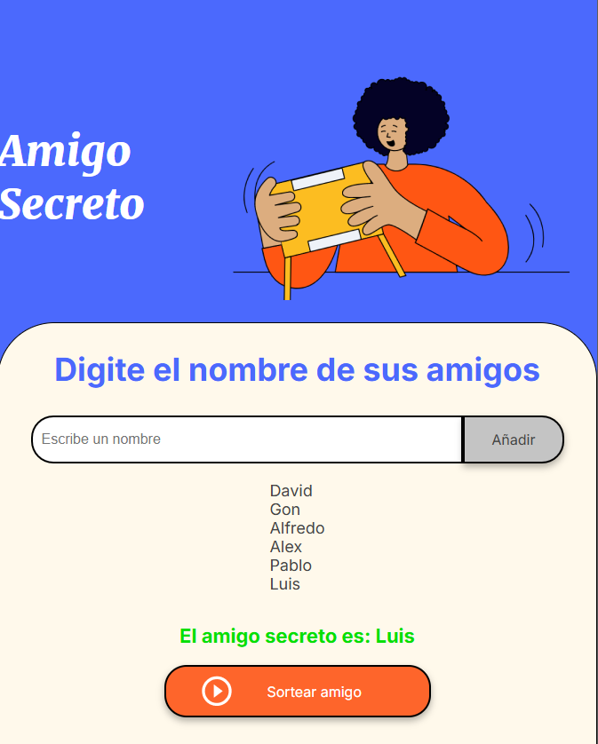

# Challenge amigo secreto
Proyecto creado para desarrolar el desafio impuesto por Aluda siguiendo las especificaciones y pasos indicados en Trello. 


En este proyecto trabajaremos con HTML, CSS y Javascript.

[](https://skillicons.dev)

## Primeros pasos

1. Descargar desde el repositorio base el proyecto con los archivos HTML y CSS.

2. Crear el repositorio en Github para trabajar el challenge.

3. Comenzar con la implementación de la logica para resolver el challenge.

## Creación de lógica en javascript

Creación de array para almacenar los nombres.

``` let amigos = []; ```

### Implementación de función para acregar amigos.

```function agregarAmigo()```

* Capturar el valor del campo de entrada.
* Validar la entrada.
* Actualizar el array de amigos.
* Limpiar el campo de entrada.

```function sortearAmigo()```

* Validar que haya amigos disponible.
* Generar un índice aleatorio.    
* Obtener el nombre sorteado.
* Mostrar el resultado.


## Objetivo del proyecto 

* añadir nombres a través del input.
* Si no se pasa ningún nombre levantar una alerta advirtiendo esto. 
* ingresar los nombres dentro de una lista de amigos y desplegarlos en el codigo por medio de una etiquetra ```li```.
* sortear de forma aleatoria los nombres de amigos de la lista y mostar en pantalla el nombre seleccionado aleatoriamente. 

